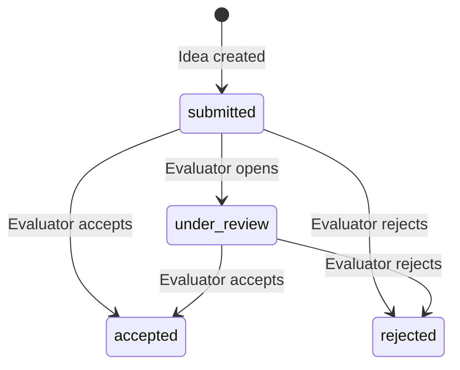

# Data Model: InnovatEPAM Portal — Phase 1 MVP

**Branch**: `001-portal-phase1-mvp`
**Date**: 2026-02-25

## Entity-Relationship Diagram

```mermaid
erDiagram
    USER ||--o{ IDEA : "submits"
    USER ||--o{ EVALUATION : "performs"
    IDEA ||--o| EVALUATION : "receives"

    USER {
        uuid id PK
        varchar email UK
        varchar username
        text hashed_password
        varchar role
        timestamptz created_at
    }

    IDEA {
        uuid id PK
        varchar title
        text description
        varchar category
        varchar status
        uuid author_id FK
        varchar attachment_path
        timestamptz created_at
        timestamptz updated_at
    }

    EVALUATION {
        uuid id PK
        uuid idea_id FK_UK
        uuid evaluator_id FK
        varchar decision
        text comment
        timestamptz created_at
    }
```

## Entities

### User

| Field | Type | Constraints | Notes |
|-------|------|-------------|-------|
| id | UUID | PK, default `gen_random_uuid()` | Immutable |
| email | VARCHAR(255) | UNIQUE, NOT NULL | Login identifier |
| username | VARCHAR(100) | NOT NULL | Display name |
| hashed_password | TEXT | NOT NULL | bcrypt hash |
| role | VARCHAR(20) | NOT NULL, DEFAULT `'submitter'`, CHECK IN (`submitter`, `evaluator`) | Role-based access |
| created_at | TIMESTAMPTZ | NOT NULL, DEFAULT `NOW()` | Audit |

**Validation rules**:

- Email MUST be a valid RFC 5322 address (validated by Pydantic `EmailStr`).
- Username MUST be 3–100 characters.
- Password MUST be ≥ 8 characters (validated at schema level, stored as bcrypt hash).

---

### Idea

| Field | Type | Constraints | Notes |
|-------|------|-------------|-------|
| id | UUID | PK, default `gen_random_uuid()` | Immutable |
| title | VARCHAR(255) | NOT NULL | Required input |
| description | TEXT | NOT NULL | Required input |
| category | VARCHAR(100) | NOT NULL | From predefined list |
| status | VARCHAR(20) | NOT NULL, DEFAULT `'submitted'`, CHECK IN (`submitted`, `under_review`, `accepted`, `rejected`) | State machine |
| author_id | UUID | FK → `users.id`, NOT NULL | Who submitted |
| attachment_path | VARCHAR(500) | NULLABLE | Local filesystem path |
| created_at | TIMESTAMPTZ | NOT NULL, DEFAULT `NOW()` | Audit |
| updated_at | TIMESTAMPTZ | NOT NULL, DEFAULT `NOW()` | Updated on status change |

**Indexes**:

- `idx_ideas_author` on `author_id` — for "my ideas" filtering (FR-016)
- `idx_ideas_status` on `status` — for evaluation queue queries

**State transitions**:



**Validation rules**:

- Title MUST be 1–255 characters.
- Description MUST be non-empty.
- Category MUST be one of the predefined values (checked at schema level).
- Attachment file MUST be ≤ 5 MB and one of: PDF, PNG, JPG, DOCX.

---

### Evaluation

| Field | Type | Constraints | Notes |
|-------|------|-------------|-------|
| id | UUID | PK, default `gen_random_uuid()` | Immutable |
| idea_id | UUID | FK → `ideas.id`, UNIQUE, NOT NULL | One evaluation per idea |
| evaluator_id | UUID | FK → `users.id`, NOT NULL | Who evaluated |
| decision | VARCHAR(20) | NOT NULL, CHECK IN (`accepted`, `rejected`) | Outcome |
| comment | TEXT | NOT NULL | Mandatory review comment |
| created_at | TIMESTAMPTZ | NOT NULL, DEFAULT `NOW()` | Audit |

**Validation rules**:

- The UNIQUE constraint on `idea_id` enforces one evaluation per idea
  (FR-015).
- Comment MUST be non-empty (FR-014).
- Decision MUST be either `accepted` or `rejected`.

---

## Predefined Categories (Configuration)

Per spec assumptions, categories are a static list in Phase 1:

| Value | Display Name |
|-------|-------------|
| `process_improvement` | Process Improvement |
| `product_innovation` | Product Innovation |
| `tech_enhancement` | Technology Enhancement |
| `culture_initiative` | Culture & People Initiative |
| `cost_optimization` | Cost Optimization |
| `other` | Other |
